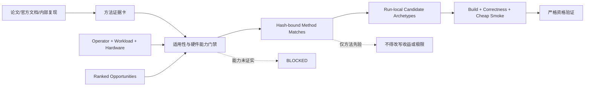

# 算子调优方法学习层：从 DAS 综述管线到可执行候选

## 1. 结论

DAS 式论文阅读库对算子 Agent 有帮助，但不能直接把“综述”塞进上下文。
真正可复用的是它的证据生产结构：检索、筛选、证据卡、分类综合和审查。
算子调优需要把普通论文证据卡进一步编译成**可执行、可迁移、可证伪的
方法卡**。

本次实现增加了一个很薄的方法学习层。它只在候选组合缺少架构多样性时工作，
单次匹配约 0.34 秒，不运行 GPU，也不扩大测量预算。方法建议只能生成
`DISCOVERY_PRIOR_ONLY` 假设；机会收益、硬件事实、候选接受和理论极限仍由原有
证据链负责。

## 2. 为什么普通综述卡不够

DAS 重建项目中的卡片已经包含问题、方法、评估、发现、限制、可引用事实、标签
和置信度。这适合生成综述，但还不足以驱动 kernel 候选，因为它没有强制回答：

1. 来源结论针对哪一种 GPU、dtype、shape 和算子结构；
2. 新硬件上哪些能力必须先由官方资料或设备查询确认；
3. 方法对应当前机会图中的哪个 rewrite family；
4. 应该写出哪几个相互独立的生产候选，而不是调哪些连续参数；
5. 预期瓶颈会从哪里迁到哪里；
6. 什么观测能证伪迁移假设；
7. 来源论文的结果边界是什么，哪些数字不能外推。

因此方法卡使用 `optimization-method-v1`，除来源和证据等级外，必须包含
applicability、required capabilities、candidate archetypes、implementation /
validation recipe、expected bottleneck shifts、failure modes 和 scope limits。

## 3. 架构修改

### 3.1 新增可复用方法库

- `knowledge/methods/*.json`：来源可追踪的方法卡；
- `schemas/optimization_method.schema.json`：失败关闭的数据契约；
- `scripts/method_library.py`：验证、匹配、排序和回执生成；
- `scripts/kernel_opt.py method validate|recommend`：稳定公共入口。

初始卡片覆盖四类输入：同行评审论文、论文预印本、NVIDIA 官方开发指南和
评估防护。具体包含 Korch 的 fission/orchestration、TileLang 的
dataflow/schedule 分离、FlashAttention-3 的异步流水、KernelBench 的反馈循环、
KernelBench-Verified 的防 reward hacking，以及 CUDA 的向量访存、
occupancy/launch frontier 和 grid-stride thread reuse。

### 3.2 机会局部匹配，避免检索污染

匹配器先要求方法与**当前单个机会**至少命中一个 rewrite family 或问题特征；
operator/workload 上下文只能辅助加分，不能让一篇全局相关论文污染所有机会。
分数偏向 family 精确命中、机会特征和较强来源证据，并惩罚架构适配和缺失能力。

硬件迁移状态分为：

- `DIRECT`：方法作为候选假设不依赖未证实硬能力；
- `ADAPTATION_REQUIRED`：来源架构亲和性与目标不一致；
- `BLOCKED_UNVERIFIED_CAPABILITY`：硬能力没有出现在目标硬件快照中；
- `INCOMPATIBLE`：vendor 明确不匹配。

例如 FlashAttention-3 卡要求 TMA 与异步 Tensor Core，并声明 Hopper/H100 来源
边界。4060 和当前 5090 快照都不会仅凭“NVIDIA”而直接采用该方法。

### 3.3 与全局调度器连接

当候选数量、架构族或机会覆盖不足时，`optimizer_step.py` 先返回
`RETRIEVE_OPTIMIZATION_METHODS`。生成的 `models/method_matches.json` 同时绑定：

- `operator.json`；
- `workload.json`；
- `hardware.json`；
- `models/opportunity_map.json`；
- 全部方法卡的路径和 SHA-256。

任一输入或方法卡变化，回执过期，调度器不会继续使用旧建议。下一步
`EXPAND_DISCOVERY_PORTFOLIO` 会带上方法模板、失败模式和验证规则，但仍要求
Agent 写 run-local 生产代码并经过原 discovery 生命周期。

### 3.4 DAS 式证据编译与时间快照

DAS 流程证明了“检索、筛选、证据卡、分类综合、全局综合、复审”可以把大量
论文压缩成可查询证据库。本层复用的是这条生产线，不复用综述正文。对 kernel
任务，方法卡可进一步携带 `algorithmic_decomposition`：baseline dependency、
partition axis、local state、combine rule、finalization、work/span complexity、
communication cost、invariants 和 anti-patterns。这样检索输出能被实例化成一个
新的工作分解，而不只是“增加 warps/换 tile”。

每个来源现在必须声明带时区的 `source.available_at`。`method export-snapshot`
按 cutoff 生成不可变方法快照；temporal suite 可把它作为 `training_methods`
绑定，且只物化到增强组。suite 验证会拒绝 cutoff 不一致、卡片无效或来源时间
晚于 cutoff 的快照。

评测结果还必须提交 `method_realization` receipt。若选择方法卡，receipt 要把
partition/local/combine/finalize 映射到当前算子，并绑定真正兑现该分解的候选；
否则只能提交带哈希证据的 `STRUCTURALLY_INFEASIBLE`。只在文字里复述方法、
最后回退到熟悉实现，不再计作方法学习成功。

### 3.5 社区实体层与可迁移原语层分离

社区 PR 不能直接当作通用方法卡：一个 PR 同时混合了目标代码、特定硬件、
生命周期、评审争议和局部 benchmark。现在知识库显式分成两层：

- 外部 corpus 的 `community-optimization-event-v1` 保存 PR 实体、不可变快照、
  review/revert/regression 和原始性能边界；
- `knowledge/primitives/*.json` 保存跨项目可复用的变换或评测原语，并通过
  `community_provenance.source_event_ids` 反向绑定来源事件。

原语只能提供 discovery prior，不能继承来源 PR 的性能数字。temporal shortlist
只有在全部来源事件都存在于冻结图中、且来源事件不晚于原语可用时间时才接受
该原语。路由预算也分开：最多两个 transformation/orchestration 和一个
evaluation guard，避免安全检查挤掉真正可写代码的候选路线。

首批原语覆盖 host loop 到 segmented array、有限值域重排、按架构条件融合、
fast-path 可达性、带一致性证明的校验外提，以及跨层状态契约。对已经揭晓答案的
causal-conv 题做回放时，路由器能同时找回来源事件和 segmented-array 原语；
这只是 routing retrospective，不能作为方法层带来因果收益的 A/B 证据。

原语本身也必须可被实验推翻和细化。sealed prospective structured-mask A/B 中，
逐元素 segmented-array 候选在唯一 realized repeat 上为 1.225x，control 的连续
span + full-coverage fast path 为 1.261x；原语虽被正确实现，却在首次正确时间和
架构覆盖上同样落后。由此新增 `segmented-transfer-granularity`：先区分元素生成、
连续 span、一般 permutation 与全覆盖 identity，再比较 auxiliary index bytes 与
payload bytes。该卡携带实验结果 hash，available-at 晚于实验结束，不能回灌原题。

## 4. 两机验证

验证对象沿用已授权的 synthetic fused-affine-ReLU workload；它用于验证搜索
控制与 memory-bound 候选，不代表任何尚未冻结输入的真实生产算子。

### 本地 RTX 4060 Laptop GPU

- 五个机会分别匹配到 launch/occupancy、Korch orchestration、向量访存、
  thread coarsening 和 grid-stride persistence；
- 方法匹配耗时约 0.34 秒；
- 复跑 `coarsened4`：正确性通过，weighted candidate 约 1870.19 us，
  matched copy reference 约 1911.58 us，单次 correctness + smoke 约 2.87 秒；
- edge case 明显慢于 copy reference，说明 weighted winner 不能被误称为全形状最优。

### 远端 RTX 5090

- 运行时已有其他进程占用约 26 GB 显存，但 GPU utilization 查询为 0%；
- 对历史最佳 `vector2` 做短复跑：正确性通过，weighted candidate 约
  281.30 us，matched copy reference 约 281.70 us；
- correctness 约 0.15 秒，smoke 约 0.40 秒；
- 结果说明该 synthetic memory-streaming 候选已经贴近同一 harness 下的 copy
  路径，但 copy reference 不是硅片理论下界，也不是外部 SOTA。

新增方法库没有“事后发明”这些候选；它做的是从现有机会图中快速、正确地
恢复同类架构路线，并在新 run 缺候选时提供可执行模板。证明它能提高真实
新算子的命中率，还需要在冻结的真实 operator/workload/environment 上做
有无方法层的固定预算 A/B。

### 4.3 4060 top-p 方法快照诊断复测

共享 harness 建好后，先有一轮不带论文方法快照的 blind-v3：control 找到
1.419x 的 B=1 framework-sort 分流，community arm 没有得到可测候选。随后加入
一张来源于 NVIDIA GPU Gems 3（2007）的通用层次 scan 卡，并以
2026-08-31 cutoff 导出 8 张可用卡；两张 cutoff 后卡被自动排除。

v4 使用同一历史源码、题面、4060、harness、模型、600 秒和候选预算。单次配对
结果为：

- 方法增强组首个正确候选 226.3 秒，最佳 1.4567x，held-out PASS；
- control 首个正确候选 390.0 秒，最佳 0.9907x，无候选进入 held-out；
- 增强组快 163.7 秒得到首个正确候选，但架构族 1 对 control 的 2；
- 最终 1.4567x 仍是 B=1 framework sort 分流，不是层次 scan 实现，也没有整模
  或 upstream-ready 证据。

这轮是观察过旧任务后的**诊断性复测**，不能当作首次确认或统计结论。它支持
“方法卡可能改善搜索优先级”，不支持“Agent 已学会生成新并行 scan”。方法卡
确实让 Agent 写出了 vocabulary-partitioned summary/refinement 设计，但由于全局
排序与精确重复值语义，它退回了安全的库排序控制。下一项能力缺口因此从
“检索不到大方向”收窄为“不能把抽象分解稳定编译成正确的生产候选”。

## 5. 解决了什么，没有解决什么

已经解决：

- 避免 Agent 不知道还有哪些架构族，只在一个参数附近打转；
- 把“读过论文”变成候选模板、失败模式和验证步骤；
- 防止跨架构术语迁移冒充硬件事实；
- 方法库查询在亚秒级完成，不引入几十小时文献推理；
- 输入或知识变化后旧建议自动失效；
- 引入 held-out、baseline parity 和 memory accounting 防 reward hacking。

仍未解决：

- 有限方法卡不可能覆盖所有新算子；
- 文献方法不能给出目标算子的收益值，收益仍必须来自机会模型和实测；
- “理论最优”仍要求逐 case 硅片、资源服务、DAG 下界和可行调度上界；
- “超过 SOTA”仍要求相同 ABI、数值、shape 分布、硬件、软件栈和计时语义下的
  外部基线；
- 当前 5090 缺少完整目标源码/依赖环境，不能诚实地给出真实算子改造效果。

## 6. 下一项最有价值的实验

不是在这个已经观察过答案的 top-p 任务上继续追分，而是预注册新的真实算子族：

1. 冻结 operator、workload、hardware 和 baseline；
2. A 组只用机会图，B 组额外使用方法卡；
3. 两组各给相同候选数、编译次数和墙钟预算；
4. 比较 time-to-first-correct、time-to-first-improvement、架构族覆盖、best-at-10m、
   best-at-30m、正确率和 held-out regression；
5. 增强组必须至少实现一个匹配卡中的工作分解，或提交结构化不可行证据；
6. 只有跨任务、重复运行稳定改善这些指标，才能说“论文理解库增强了 Agent”，
   而不是只让输出更像专家。
